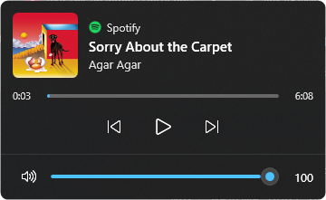

# Media Flyout for Windows 11

**English** · [Türkçe](#türkçe)

Brings back the Windows 10 style "now playing" flyout on Windows 11, with a modern look. When you press a media key, a volume key, or the volume changes, a small panel appears in the top-left corner showing what's playing, with controls and a volume slider.



## Features

- Appears when you press **media keys** (play/pause, next, previous), **volume keys**, or when the system volume changes. Optionally also when the track changes.
- Shows **album art**, title, artist, the **source app** (with its icon) and a **seekable progress bar**.
- Previous / play-pause / next buttons, a volume slider and a mute button. You can also scroll the mouse wheel over the flyout to change the volume.
- Click the album art or title to bring the source app to the front.
- Native Windows 11 look: acrylic blur, rounded corners, follows the system **light/dark theme** and **accent color**.
- **Never steals focus.** Safe while typing or gaming. It also doesn't pop up on track changes while a fullscreen game or presentation is running.
- Works with anything that reports to Windows' media controls: Spotify, YouTube in Chrome/Edge/Firefox, Media Player, and more.
- Lightweight tray app. Turkish and English UI (follows your Windows language, or choose manually).

## Download

1. Download `MediaFlyout.exe` from the [Releases](../../releases) page.
2. Make sure the [.NET 8 Desktop Runtime](https://dotnet.microsoft.com/download/dotnet/8.0) (x64) is installed. Windows will offer to install it on first run if it's missing.
3. Run it. The app lives in the system tray (look under the `^` arrow if you don't see the icon).

To launch it automatically, right-click the tray icon and enable **Start with Windows**.

## Tray menu

| Option | Description |
| --- | --- |
| Preview | Shows the flyout |
| Show when the track changes | Shows the flyout automatically when a new song starts |
| Position | Top left / top center / top right |
| Display duration | 2, 3, 5 or 8 seconds |
| Language | System default / Türkçe / English |
| Start with Windows | Adds or removes the app from startup |

Settings are stored in `%AppData%\MediaFlyout\settings.json`. Errors, if any, are logged to `error.log` in the same folder.

## Notes

- Games in **borderless/windowed** mode (and most modern fullscreen games on Windows 11) show the flyout. Games running in true exclusive fullscreen can't be drawn over by any window.
- If a game runs **as administrator**, Windows hides its key presses from regular apps, so media keys may not open the flyout there. Volume changes still do.
- Windows 11's own volume indicator still appears at the bottom of the screen. This app doesn't replace or hide it.

## Building from source

Requires the [.NET 8 SDK](https://dotnet.microsoft.com/download/dotnet/8.0) on Windows.

```powershell
git clone https://github.com/krmkucuk/win11-media-flyout.git
cd win11-media-flyout
dotnet run -c Release

# Single-file exe in .\publish
dotnet publish -c Release -r win-x64 --self-contained false -p:PublishSingleFile=true -p:DebugType=none -o publish
```

### How it works

- **Media info:** `Windows.Media.Control.GlobalSystemMediaTransportControlsSessionManager` (the same API Windows uses).
- **Volume:** Core Audio endpoint volume notifications via [NAudio](https://github.com/naudio/NAudio).
- **Keys:** a low-level keyboard hook that only *observes* media and volume keys. Keys are never blocked.
- **UI:** WPF window with an acrylic backdrop, DWM rounded corners, and `WS_EX_NOACTIVATE` so it never takes focus.

## License

[MIT](LICENSE)

---

## Türkçe

Windows 10'daki "şu an çalıyor" penceresini Windows 11'e modern bir görünümle geri getirir. Medya tuşlarına veya ses tuşlarına bastığında ya da ses seviyesi değiştiğinde, sol üstte çalan şarkıyı, kontrolleri ve ses kaydırıcısını gösteren küçük bir panel açılır.

### Özellikler

- **Medya tuşlarına** (oynat/duraklat, sonraki, önceki), **ses tuşlarına** basınca veya ses seviyesi değişince açılır. İstersen şarkı değişince de açılır.
- **Albüm kapağı**, şarkı adı, sanatçı, şarkıyı **çalan uygulama** (ikonuyla) ve tıklanarak **ileri/geri sarılabilen ilerleme çubuğu**.
- Önceki / oynat-duraklat / sonraki düğmeleri, ses kaydırıcısı, sessize alma. Pencerenin üzerinde fare tekerleğiyle de ses ayarlanabilir.
- Kapağa veya şarkı adına tıklayınca şarkıyı çalan uygulama öne gelir.
- Windows 11 görünümü: akrilik bulanıklık, yuvarlak köşeler, sistemin **açık/koyu temasına** ve **vurgu rengine** uyum.
- **Odak çalmaz.** Yazı yazarken veya oyun oynarken güvenle kullanılabilir. Tam ekran oyun veya sunum açıkken şarkı değişince kendiliğinden açılmaz.
- Windows'a medya bilgisi gönderen her uygulamayla çalışır: Spotify, Chrome/Edge/Firefox'ta YouTube, Medya Oynatıcı vb.
- Sistem tepsisinde çalışan hafif bir uygulama. Türkçe ve İngilizce arayüz (Windows diline göre otomatik seçilir, menüden de değiştirilebilir).

### Kurulum

1. [Releases](../../releases) sayfasından `MediaFlyout.exe` dosyasını indir.
2. [.NET 8 Desktop Runtime](https://dotnet.microsoft.com/download/dotnet/8.0) (x64) kurulu olmalı. Kurulu değilse Windows ilk açılışta kurmayı önerir.
3. Çalıştır. Uygulama sistem tepsisinde durur (ikon görünmüyorsa saatin yanındaki `^` okuna bak).

Bilgisayar açılınca otomatik başlaması için tepsi ikonuna sağ tıklayıp **Windows ile başlat** seçeneğini işaretle.

### Notlar

- **Çerçevesiz/pencere** modundaki oyunlarda ve Windows 11'deki çoğu modern tam ekran oyunda görünür. Gerçek (exclusive) tam ekran modunda hiçbir pencere oyunun üstüne çizilemez.
- **Yönetici olarak** çalışan bir oyundayken Windows, tuş basışlarını normal uygulamalardan gizler. Bu yüzden orada medya tuşları pencereyi açmayabilir, ses değişikliği ise yine açar.
- Windows 11'in alttaki kendi ses göstergesi görünmeye devam eder.

### Lisans

[MIT](LICENSE)
